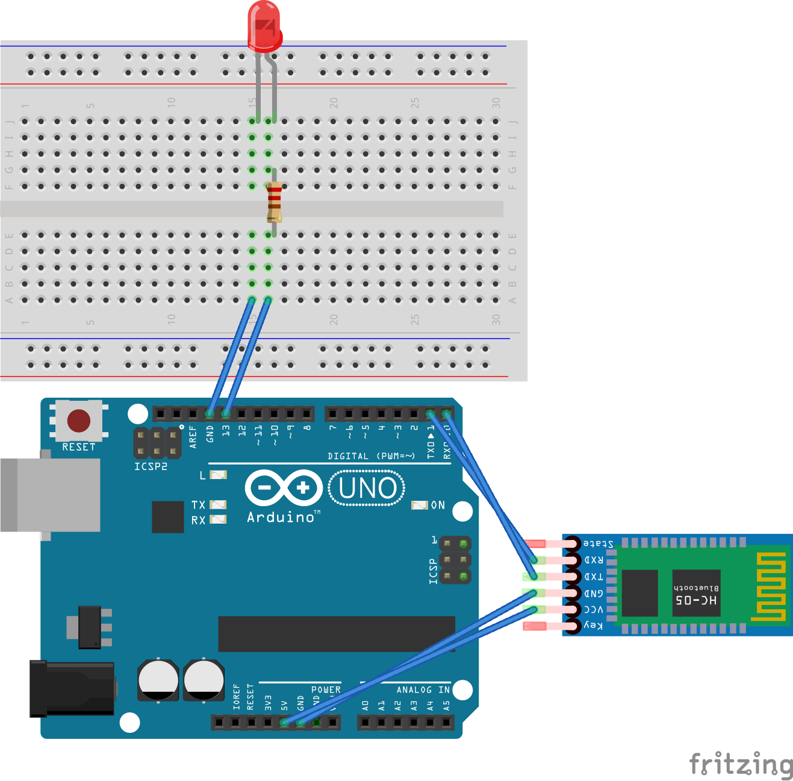

# Arduino + Bluetooth + Web API
> Control a Bluetooth module directly in the browser

## Dependencies
* Arduino Uno
* Bluetooth module
* Wires
* Resistor
* LED

## About this project

This is just a simple project to demonstrate the [Bluetooth Web API](https://developer.mozilla.org/en-US/docs/Web/API/BluetoothDevice). Please check [Can I Use](https://caniuse.com/web-bluetooth).

## Breadboard

## Usage

1. Wire up everything
2. Upload the [Arduino code](./arduino.cpp)
3. Checkout the repo and start a simple web server (e.g. `mongoose`)
4. Go to the website and connect it with your Bluetooth module
5. Toggle the LED 🎉

**Update the UUIDs in the index.html file according to your Bluetooth module!**

## Helpful links

* [Chrome link to inspect bluetooth modules](chrome://bluetooth-internals/#devices)